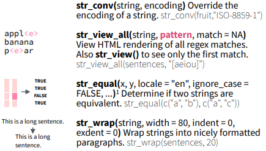

### Content
\tableofcontents[]

# Base R

## The base R functions for dealing with strings
- *substr() / substring()*: Extract or replace substrings in a character vector by indicies.
- *strsplit()*: Split the elements of a character vector x into substrings according to a given regular expression.
- *paste()*: Concatenate n number of strings.
- *nchar()*: Returns a vector of the number of characters of x.


### substr() / substring()
<!-- this sets the background -->
\metroset{block=fill} 
\begin{block}{substr()/substring():}
  Extract or replace substrings in a character vector
\end{block}

```r
num <- "12345678"
substr(num, 4, 5)
```

```
## [1] "45"
```

```r
substring(num, 1:3, 7)
```

```
## [1] "1234567" "234567"  "34567"
```


### strsplit()
<!-- this sets the background -->
\metroset{block=fill} 
\begin{block}{strsplit():}
  Split the elements of a character vector x into substrings according to a given character
\end{block}

```r
str = "Splitting sentence into words"
strsplit(str, " ")
```

```
## [[1]]
## [1] "Splitting" "sentence"  "into"      "words"
```


### paste()
<!-- this sets the background -->
\metroset{block=fill} 
\begin{block}{paste():}
  Concatenate n number of strings
\end{block}

```r
paste("Count number", "of characters")
```

```
## [1] "Count number of characters"
```


### nchar()
<!-- this sets the background -->
\metroset{block=fill} 
\begin{block}{nchar():}
  Returns a vector of the number of characters of x
\end{block}

```r
nchar("Count number of characters")
```

```
## [1] 26
```


## The base R functions for dealing regular expressions
- *grep() / grepl()*: Search for matches of a regular expression/pattern in a character vector ans return the indices/a logical vector.
- *regexpr() / gregexpr()*: Search a character vector for regular expression matches and return the indices of the string where the match begins and the length of the match.
- *sub() / gsub()*: Search the first/all character vector/s for regular expression matches and replace that match with another string.


### grep() / grepl()
<!-- this sets the background -->
\metroset{block=fill} 
\begin{block}{grep():}
  Index of vector which matches regex
\end{block}

```r
grep("b+", c("abc", "bda", "cca a", "abd"))
```

```
## [1] 1 2 4
```

\begin{block}{grepl():}
  Logical if vector matches regex
\end{block}

```r
grepl("b+", c("abc", "bda", "cca a", "abd"))
```

```
## [1]  TRUE  TRUE FALSE  TRUE
```


### regexpr()
<!-- this sets the background -->
\metroset{block=fill} 
\begin{block}{regexpr():}
  Search a character vector for regular expression matches and return the indices of the string where the match begins and the length of the match
\end{block}

```r
str = "Line 129: O that this too too solid flesh would melt,Thaw, and resolve itself into a dew!"
regexpr("1",str)
```

```
## [1] 6
## attr(,"match.length")
## [1] 1
## attr(,"index.type")
## [1] "chars"
## attr(,"useBytes")
## [1] TRUE
```


### sub() / gsub()
<!-- this sets the background -->
\metroset{block=fill} 
\begin{block}{sub():}
  Search **first* match of an regular expression and replace it
\end{block}

```r
x <- "<dd>Found on January 1, 2007</dd>"
sub("<dd>[F|f]ound on |</dd>", "", x)
```

```
## [1] "January 1, 2007</dd>"
```

\begin{block}{gsub:}
  Search **all** matches of an regular expression and replace it
\end{block}

```r
x <- "<dd>Found on January 1, 2007</dd>"
gsub("<dd>[F|f]ound on |</dd>", "", x)
```

```
## [1] "January 1, 2007"
```

# Regular Expressions

### Match Characters
{width=3.8in}

### Alternates
{width=3.5in}

### Anchors
{width=3.5in}

### Look Arounds
{width=3.5in}

### Quantifiers
{width=3.5in}


# Package: Stringr

### String basics

The stringr package provides a series of functions implementing much of the regular expression functionality in R but with a more consistent and rationalized interface.

## Detect Matches
{width=3in}

## Subset Strings
{width=3in}

## Manage Lengths
{width=3in}

## Mutate Strings
{width=3in}

### Extra: Join and Split 
{width=2.8in}

### Extra: Order Strings
{width=3in}

### Extra: Helpers
{width=3in}


# Helpful sources

- [Stringr: Overview](https://stringr.tidyverse.org/)
- [Stringr: Introduction](https://cloud.r-project.org/web/packages/stringr/vignettes/stringr.html)
- [Stringr: Cheatsheet](https://github.com/rstudio/cheatsheets/blob/master/strings.pdf)
- [Stringr: Reference manual](https://cloud.r-project.org/web/packages/stringr/stringr.pdf)
- [Base R String-functions vs Stringr](https://stringr.tidyverse.org/articles/from-base.html)
- [Working with strings in R](https://r4ds.had.co.nz/strings.html)
- [Regular expressions](https://cloud.r-project.org/web/packages/stringr/vignettes/regular-expressions.html)
- [Primary R functions for dealing with regular expressions](https://bookdown.org/rdpeng/rprogdatascience/regular-expressions.html)


### References
All graphics are taken from [String manipulaton with stringr Cheatsheet](https://github.com/rstudio/cheatsheets/blob/master/strings.pdf)
